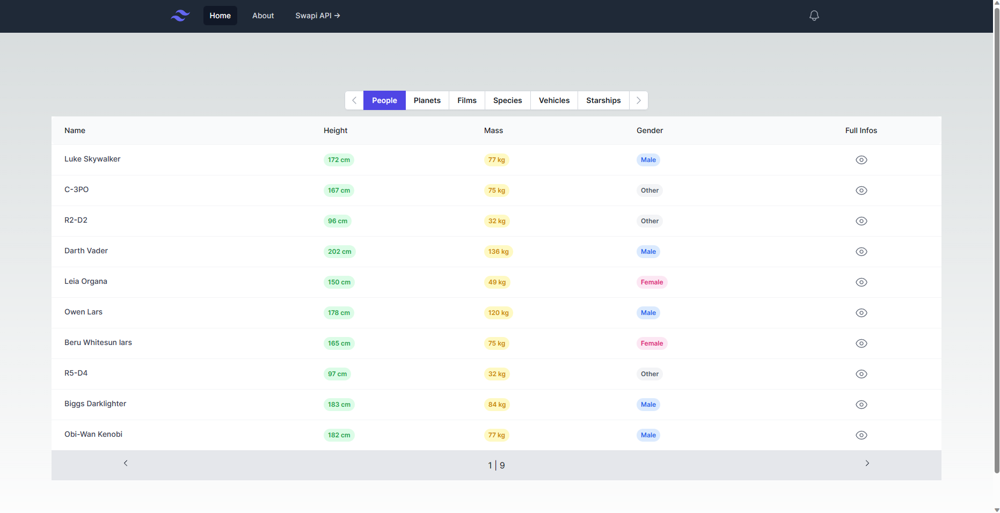

# Swapi Client

Swapi Client is a Next.js project developed in React with TypeScript. It utilizes the Tailwind CSS framework for styling and Heroicons for icons. The project serves as a data receiver for the Star Wars API (SWAPI), providing funny and interesting data about Star Wars characters.

## 💻 Technologies Used

- **Next.js** : Next.js is a React framework that enables server-side rendering (SSR) and provides an efficient development environment with features like automatic code splitting and server-side rendering.
- **React** : React is a JavaScript library for building user interfaces. It allows for component-based development and provides a declarative approach to building UIs.
- **TypeScript** : TypeScript is a typed superset of JavaScript that provides static type-checking and improved tooling for better productivity and code maintainability.
- **Tailwind CSS** : Tailwind CSS is a utility-first CSS framework that provides a set of pre-designed CSS classes, enabling rapid UI development and customization.
- **Heroicons** : Heroicons is a set of free SVG icons designed for use with Tailwind CSS, offering a wide range of customizable icons for your application.

## Project Content

The Swapi Client project aims to showcase the integration of popular technologies and frameworks to consume and display data from the Star Wars API. By leveraging Next.js, React, TypeScript, Tailwind CSS, and Heroicons, this project provides a visually appealing and user-friendly interface for accessing and exploring Star Wars character information.

The project makes use of Next.js's server-side rendering capabilities, enabling fast initial page loads and improved SEO. TypeScript ensures type safety and helps catch errors during development, while Tailwind CSS provides a flexible and responsive design system. Heroicons adds visually appealing icons to enhance the user interface.

With the Swapi Client project, you can practice working with API data, explore different Star Wars characters, and learn how to build a Next.js application using React and TypeScript.

## ⚙️ Installation

1. Clone the repository: `git clone https://github.com/your-username/swapi-client.git`
2. Navigate to the project directory: `cd swapi-client`
3. Install the dependencies: `npm install`

## ▶️ Usage

1. Start the development server: `npx next dev`
2. Open your browser and visit: `http://localhost:3000`

## 🖼️ Screenshots

### Home Page

### People table

## 🧑‍⚖️ License

This project is licensed under the MIT License. See the [LICENSE](LICENSE) file for more information.
